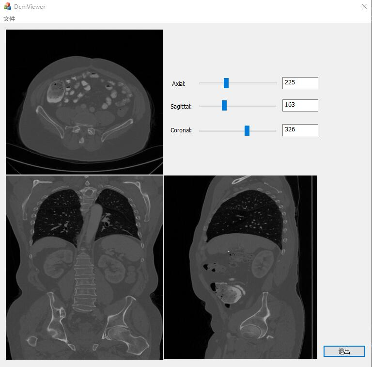

---
# OpenCT
---
This project is aim to find the Lymph nodes in CT image (format of .dcm) and rebuild sagittal view and coronal view.
It can view the CT images through the MFC module "DcmViewer".EasyCNN can be used.CT images displays by OpenCT.lib(I called it OpenCV.lib).

>  author : Wang Jianyu

>  email: wangjianyu@hit.edu.cn

>  Harbin Institute of Technology

### Samples:

### Library Dependencies：
- OpenCV 2.4.13
- CxImage 701
- DCMTK 3.6.0

### Environment and Function:

Windows x86 and higher.

### Install

Compile the Dcmviewer.exe and OpenCV.lib and EasyCNN.lib.

### TODO

Do whatever you want.

### License

No License. Fuck the License.

